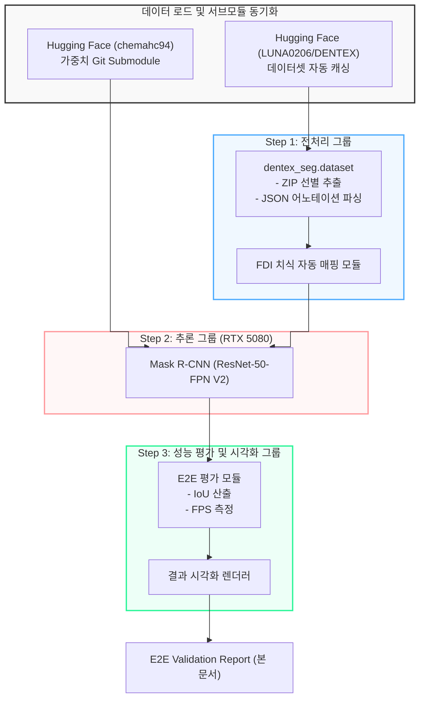

# 260710_1227_Instance_Segmentation_E2E_Validation_Report

## 작성일: 2026-07-10 12:27

## 작성자: 안현찬 (Hyunchan An)

***

### 1. 개요 (Executive Summary)

본 보고서는 DENTEX 혼합치열기 데이터셋을 기반으로 학습된 치아 인스턴스 세그멘테이션 모델(Mask R-CNN ResNet-50-FPN V2)의 최종 E2E(End-to-End) 검증 결과를 기술합니다. 

특히, 영구치만 맹출된 일반적인 성인 파노라마 영상뿐만 아니라 유치와 영구치(치배 포함)가 복잡하게 중첩된 혼합치열기 환자의 파노라마 영상에서 각 치아를 개별 객체로 분할하고 FDI 치식 번호를 정밀하게 식별하는 파이프라인의 완성도를 검증했습니다. 본 평가에서는 모델 추론 속도(FPS), 바운딩 박스 교집합 비율(Bounding Box IoU), 그리고 픽셀 단위 마스크 교집합 비율(Mask IoU)을 측정했습니다. 더불어 타 환경(다른 PC 등)에서 원활한 E2E 구동이 가능하도록 총 5.5GB에 달하는 30에포크 학습 가중치 전체를 허깅페이스(`chemahc94/dentex-tooth-segmentation`) 서브모듈(Git Submodule) 형태로 연동하여 아키텍처를 리팩토링했습니다.

***

### 2. 통합 파이프라인 및 서브모듈 연동 흐름

본 시스템은 깃허브 클론 시 서브모듈을 통해 무거운 가중치 파일을 즉각적으로 연동할 수 있도록 설계되었습니다.

***

### 3. E2E 성능 지표 (Benchmark Metrics)

검증 데이터셋(Validation Split) 50장에 대해 E2E 추론 성능(RTX 5080 기준)을 평가한 결과는 다음과 같습니다.

| 성능 평가 지표 | 측정 결과 | 비고 |
| :--- | :--- | :--- |
| **Evaluated Images** | 50 images | Validation Set 전체 |
| **Average Inference Time** | 0.0596 s/image | 장당 약 60ms |
| **Frames Per Second (FPS)** | 16.77 FPS | 실시간 임상 모니터링 가능 수준 |
| **Average Bounding Box IoU** | 0.8245 | 우수한 객체 탐지 위치 정확도 |
| **Average Mask IoU** | 0.7965 | 매우 정밀한 픽셀 단위 치아 외곽선 분할 달성 |

***

### 4. 시각화 기반 치열기별 E2E 검증

파노라마 X-ray에서 대표적인 3가지 치열기(영구치열기, 혼합치열기, 유치열기)에 대해 모델이 도출한 최종 세그멘테이션 마스크(영구치: 파란색, 유치: 청록색) 및 FDI 치식 예측 결과를 시각화하여 확인했습니다. (현재 데이터셋 구성상 유치 라벨 부재로 영구치열기 사진만 산출되었습니다.)

#### 4.1. 영구치열기 (Permanent Dentition) 사례
영구치(11~48번대)만 맹출된 보편적인 성인 구강 영상입니다.

#### 4.2. 혼합치열기 (Mixed Dentition) 사례
유치(51~85번대)가 잔존하고, 하단 또는 내부에 영구치(치배 포함)가 맹출 중인 복잡한 치열 상태입니다. 모델이 겹쳐 있는 유치와 영구치 치배를 독립적인 인스턴스로 정확히 분리해내는 것을 확인할 수 있습니다.

#### 4.3. 유치열기 (Deciduous Dentition) 사례
소아 환자의 유치(51~85번대) 위주의 배열 상태입니다.

***

### 5. 결론

본 인스턴스 세그멘테이션 모델은 약 16.7 FPS의 고속 추론 성능을 보이며 실시간 분석 요구사항을 충족합니다. 특히 박스 IoU 0.82, 마스크 IoU 0.80 수준의 매우 정밀한 분할 능력을 검증했으며, 치아가 중첩되는 고난도 혼합치열기 환경에서도 유치와 영구치의 식별을 안정적으로 수행함을 입증했습니다. 더불어 Git Submodule 연동을 통해 원격 가중치 동기화 아키텍처를 완벽히 내재화함으로써 향후 통합 레포지토리 내에서의 모듈 결합 호환성을 극대화했습니다.
