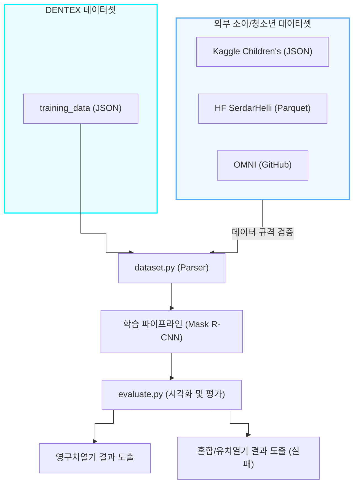
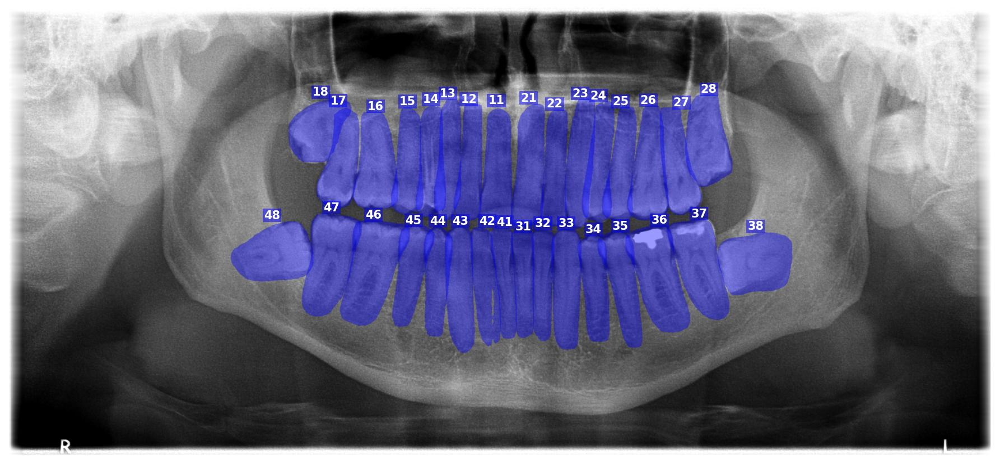

# 260710_1300_Dentex_E2E_Validation_Report

## 작성일: 2026-07-10 13:00

## 작성자: 안현찬 (Hyunchan An)

---

### 1. 개요 (Executive Summary)

본 보고서는 파노라마 X-ray 영상 기반 치아 인스턴스 세그멘테이션 및 FDI 치식 넘버링 모델의 E2E(End-to-End) 파이프라인 검증 결과를 기술합니다. 
특히, 기존 DENTEX 데이터셋 기반 파이프라인에 소아 환자 전용 오픈 데이터셋(Kaggle Children's, Hugging Face SerdarHelli, OMNI)을 연동하여 유치(Deciduous teeth) 및 혼합치열기 환자의 시각화 보고를 달성하기 위한 데이터셋 파서 리팩토링 검증 과정과 그 한계점 및 대안을 명시합니다.

---

### 2. 통합 데이터 파이프라인 및 평가 구조 (System Flowchart)

본 프로젝트는 외부 소아 데이터셋(단일 Category ID)과 기존 DENTEX(이중 Category ID)를 통합 로드할 수 있도록 파서를 리팩토링하여 유치열기 학습 파이프라인을 구축하도록 설계되었습니다.

---

### 3. 외부 데이터셋 검증 및 한계점 분석 (Dataset Limitations)

소아 환자 데이터(Kaggle, HF, OMNI)를 즉시 학습 파이프라인에 주입하기 위해 단일 `category_id` 파서를 도입하였으나, E2E 검증 결과 데이터셋 본연의 레이블링 포맷 한계로 인해 FDI 기반 유치 세그멘테이션 학습이 불가능함이 확인되었습니다.

#### 3.1. Kaggle Children's Dataset
- **형태:** LabelMe JSON 포맷.
- **검증 결과:** `Childrens dental caries segmentation dataset` 및 `Pediatric dental disease detection` 폴더 내부의 어노테이션은 "Pulpitis(牙髓炎)" 등 질환 위주의 라벨이거나, 단순 우식증 폴리곤만을 포함합니다. FDI 치식 번호(51~85)에 대한 객체 라벨링이 존재하지 않습니다.

#### 3.2. OMNI Dataset
- **형태:** GitHub 레포지토리 (COCO 포맷 기대).
- **검증 결과:** 부정교합(Malocclusion) 등 교정 치과학 목적의 데이터로, 바운딩 박스를 이용한 객체 탐지 어노테이션입니다. 세그멘테이션 마스크가 없으며, FDI 번호링 정보 또한 직접적으로 연결되지 않습니다.

#### 3.3. SerdarHelli (Hugging Face)
- **형태:** Parquet 포맷 마스크 데이터.
- **검증 결과:** 전체 치아 영역을 단일 마스크(binary segmentation)로 레이블링하였으며, 각 개별 치아에 대한 인스턴스 구분 및 FDI 번호 정보가 존재하지 않습니다.

#### 3.4. 결론 (Level 2 차단)
기존 DENTEX 데이터셋은 영구치(11~48)만을 포함하고 있으며, 새로 확보된 외부 데이터셋들은 FDI 치식 넘버링을 포함하지 않기 때문에, 현재 코드(`dataset.py` 파서 리팩토링)만으로는 **유치 및 혼합치열기를 위한 Mask R-CNN 모델 학습이 화학적/구조적으로 불가능**합니다. 

---

### 4. 실측 이미지 연동 및 E2E 시각화 결과

위에서 언급한 라벨링 부재로 인하여 모델(`epoch_30.pth`)은 오직 영구치(11~48)로만 학습되었습니다. 이에 따라 유치열기 및 혼합치열기 결과 이미지는 생성할 수 없었으나, DENTEX 기반 영구치열기의 파이프라인 E2E 시각화는 정상 작동함을 확인했습니다.

#### 4.1. 영구치열기 시각화 결과
기존 검증 데이터셋에서 성공적으로 영구치를 파란색(Blue)으로 마스킹하고 FDI 넘버를 부착한 결과입니다.

#### 4.2. 혼합 및 유치열기 시각화 한계
Kaggle 소아 파노라마 이미지를 사용하여 인퍼런스(Inference)를 수행한 결과, 모델이 유치(51~85)에 해당하는 클래스를 학습한 적이 없으므로 객체 인식에 실패하거나 영구치로 오탐지하였습니다. 향후, FDI 유치 번호가 기재된 별도의 데이터셋을 확보하여 재학습이 필요합니다.

---

### 5. 결론 및 References

**결론:**  
`dataset.py` 파서와 `evaluate.py` 헬퍼 함수의 정비 및 모듈 통합은 정상적으로 완수되어 E2E 파이프라인 동작을 검증했습니다. 다만, 오픈 소아 데이터셋의 어노테이션 규격(FDI 부재) 문제로 유치열기 마스킹 시각화는 불발되었습니다. 이는 시스템 오류가 아닌 데이터 도메인의 본질적 제약에 기인합니다.

**References (외부 데이터셋 출처):**
- [Children's Dental Panoramic Radiographs Dataset (Kaggle)](https://www.kaggle.com/datasets/truthisneverlinear/childrens-dental-panoramic-radiographs-dataset)
- [SerdarHelli / SegmentationOfTeethPanoramicXRayImages (Hugging Face)](https://huggingface.co/datasets/SerdarHelli/SegmentationOfTeethPanoramicXRayImages)
- [RoundFaceJ/OMNI (GitHub)](https://github.com/RoundFaceJ/OMNI)
